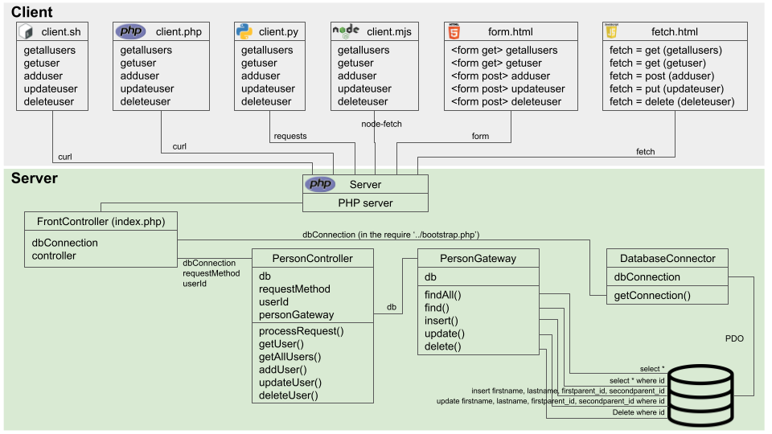

# PHP REST API
<h2>Purpose</h2>
This work is the implementation of a <a href="https://developer.mozilla.org/en-US/docs/Glossary/CRUD">CRUD</a> system with <a href="https://en.wikipedia.org/wiki/Representational_state_transfer">REST</a> <a href="https://en.wikipedia.org/wiki/Web_API">API</a> created in PHP without a framework. The basis for this is the Okta article <a href="https://developer.okta.com/blog/2019/03/08/simple-rest-api-php">Build a Simple REST API in PHP</a> but without authentication. 
<h2>Architecture</h2>
It has a database and a server-side PHP application to provide a REST API functionality to clients written in PHP, Bash, Python, Node, HTML forms and HTML/JavaScript. 
For a version of a similar implementation with authentication, please refer to <a href="https://github.com/adriano-pinaffo/php_rest_api_with_okta">this project</a>. 
This system simulates the registering of persons on a database. 
 
The following diagram shows all the clients on top and the server-side application on the bottom part. 
<figure>

<figcaption>REST API Architecture diagram</figcaption>
</figure>
 
<h2>Components</h2>
The server is composed of four parts:
<ul>
    <li><b>FrontController</b>: implemented in the <i>index.php</i>, it validates the request. Then, the FrontController processes it by calling the <code>PersonController</code>'s <code>processRequest</code> method.</li>
    <li><b>DatabaseConnector</b>: implemented in <i>DatabaseConnector.php</i> and called by <i>bootstrap.php</i>, which will be imported (<i>require</i>d) by <i>index.php</i>, it opens the connection to the database. The database parameters are located in the .env local file, and are loaded by <a href="https://github.com/vlucas/phpdotenv">phpdotenv</a>.</li>
    <li><b>PersonController</b>: implemented in <i>PersonController.php</i>, it instantiates the <code>PersonGateway</code> to handle the database processes. It also implements the method verification, data validation/sanitization. Depending on the HTTP method a different method from <code>PersonGateway</code> is invoked.</li>
    <li><b>PersonGateway</b>: implemented in <i>PersonGateway.php</i>, it is the "model" that handles database activities. It implements the methods with <a href="https://www.php.net/manual/en/pdo.prepared-statements.php">PDO prepare</a> to protect the database from SQL injection.</li>
</ul>
<h2>How to use it</h2>
<ul>
<li>Be sure to have PHP installed.
<li>Clone this repository, enter in the root folder and run <code>php -S 127.0.0.1:8000 -t public</code> (it can be run as well with any Web server, or in the background by forking with <code>&</code> or <code>nohup</code>).
</ul>
<h2>Clients</h2>
Six types of clients are available to work as an API client. As for the clients, please go to the <a href="https://github.com/adriano-pinaffo/php_rest_api/tree/master/client">client section</a> to see examples and how to use them.
