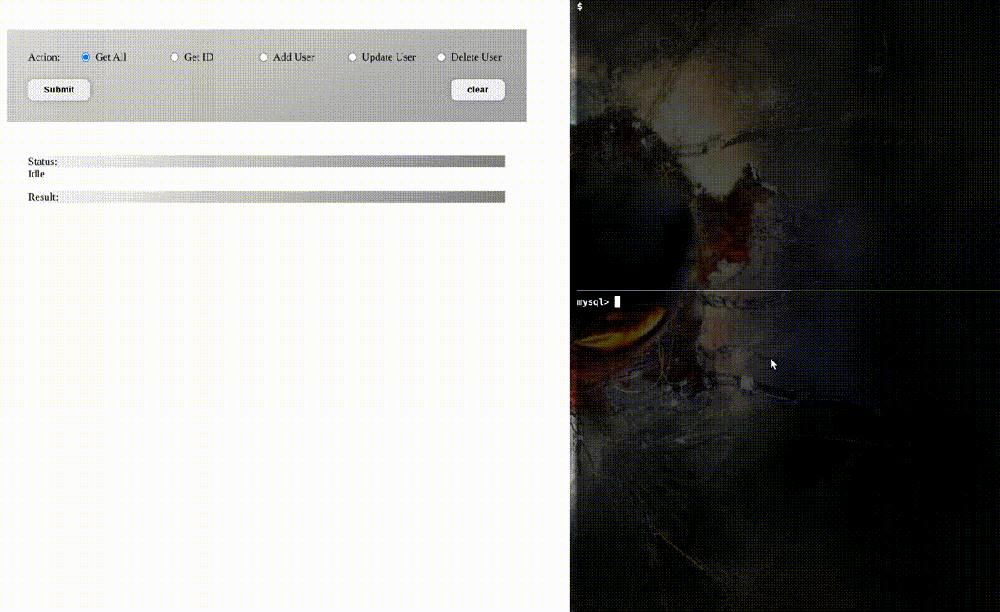
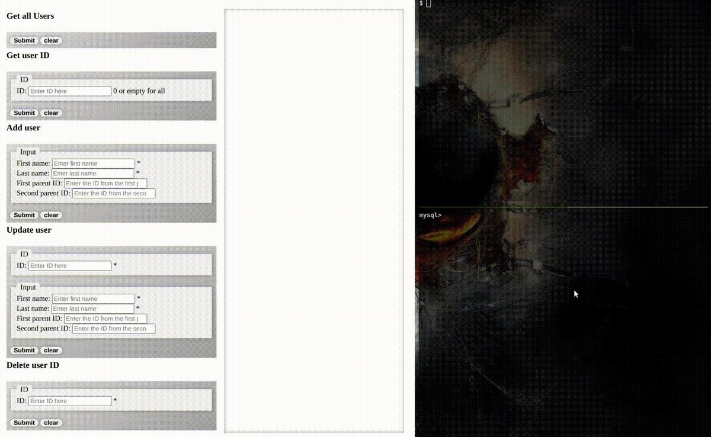
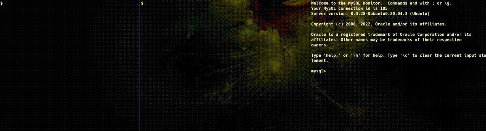
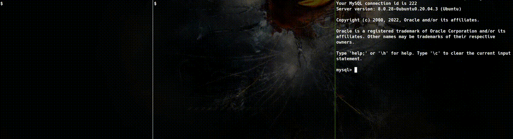

# Clients for the PHP REST API
<ul>
    <li><a href="#clients">Clients</a></li>
    <ul>
        <li><a href="#javascript">HTML/JavaScript client</a></li>
        <li><a href="#forms">HTML/Forms client</a></li>
        <li><a href="#php">PHP client</a></li>
        <li><a href="#bash">Bash client</a></li>
        <li><a href="#python">Python client</a></li>
        <li><a href="#node">Node client</a></li>
    </ul>
</ul>
<h2 id="clients">Clients</h2>
<h3 id="javascript">HTML/JavaScript</h3>

Client written using HTML form elements and JavaScript. A fetch is made to the server using the appropriate method. For the post and update (PUT) the data is passed not as <code>Content-Type: multipart/form-data</code> but as <code>Content-Type: application/json</code>. As such, the server is prepared to get the input data using the <a href="https://www.php.net/manual/en/wrappers.php.php">wrapper</a> <code>php://input</code>.

<h4>How to use</h4>

After the server is started, open the <i>fetch.html</i>, fill in the inputs as below and submit.

<h3 id="forms">HMTL/Forms</h3>

Client written using HTML form elements. JavaScript code is only used to set the proper form action and to clean the resulting area, which is an <code>iframe</code>. As typical as HTML forms, only GET and POST are allowed methods according to the <a href="https://html.spec.whatwg.org/multipage/form-control-infrastructure.html#attr-fs-method">HTML specs</a>. To overcome this, data related to updates (HTTP PUT) and delete (HTTP DELETE) is sent with POST methods. To make this work, the form for update and delete have a hidden form field with the original method name as its 'name' property, and the PHP server treats that by reading the field received and calling the proper handler.

<h4>How to use</h4>

Just open the <i>form.html</i> in a browser, fill in the inputs as below and submit.

<h3 id="php">PHP client.php</h3>

Client written in pure PHP. It heavily relies on the <a href="https://www.php.net/manual/en/book.curl.php">PHP cURL library</a>. By default, the result will be in csv format. It can also give the result in a raw format <code>var_dump()</code> and associative array by uncommenting the indicated code in the <i>client.php</i>.

<h4>How to use</h4>
<pre><code>$ php client/client.php &lt;command> [options]</code></pre>

Examples:

<pre><code>
&#35; To get all users:
$ php client/client.php getallusers
$ php client/client.php getuser
 
&#35; To get one user with ID 10:
$ php client/client.php getuser 10
 
&#35; To add a user:
$ php client/client.php adduser '{"firstname": "Linus", "lastname": "Torvalds"}'
 
&#35; To update a user:
$ php client/client.php updateuser 5 '{"firstname": "Steve", "lastname": "Jobs", "firstparent_id": 3, "secondparent_id": 2}'
 
&#35; To delete a user:
$ php client/client.php deleteuser 7
</code></pre>

<h3 id="bash">Bash client.sh</h3>

Client written in bash. It will rely on <a href="https://curl.se/">cURL</a>. This code intends to be simple, so the result will be output to stdout as it came from the API server. The developer can, however, adapt it to use <a href="https://stedolan.github.io/jq/">jq</a> very easily.

<h4>How to use</h4>
<pre><code>$ client/client.sh &lt;command> [options]</code></pre>

Examples:

<pre><code>
&#35; List all users:
$ client/client.sh getallusers
$ client/client.sh getuser
 
&#35; List a user ID:
$ client/client.sh getuser 2
 
&#35; Add a user:
$ client/client.sh adduser '{"firstname": "Dennis", "lastname": "Ritchie", "firstparent_id": 4, "secondparent_id": 3}'
 
&#35; Update a user by ID:
$ client/client.sh updateuser 90 '{"firstname": "Dennis", "lastname": "Ritchie", "firstparent_id": 5, "secondparent_id": 6}'
 
&#35; Delete a user by ID:
$ client/client.sh deleteuser 7
</code></pre>

<h3 id="python">Python client.py</h3>

Client written in python. It will rely on the <a href="https://requests.readthedocs.io/">request module</a>. By default, it will output the result in csv format. It can also give the result in a python object format, a table format and a json format just by uncommenting the indicated code in the <i>client.py</i>.

<h4>How to use</h4>
<pre><code>$ python client/client.py &lt;command> [options]</code></pre>

Examples:

<pre><code>
&#35; List all users:
$ python client/client.py getallusers
$ python client/client.py getuser
 
&#35; List a user ID:
$ python client/client.py getuser 2
 
&#35; Add a user:
$ python client/client.py adduser '{"firstname": "Dennis", "lastname": "Ritchie", "firstparent_id": 4, "secondparent_id": 3}'
 
&#35; Update a user by ID:
$ python client/client.py updateuser 90 '{"firstname": "Dennis", "lastname": "Ritchie", "firstparent_id": 5, "secondparent_id": 6}
 
&#35; Delete a user by ID:
$ python client/client.py deleteuser 7
</code></pre>

<h3 id="node">Node client.mjs</h3>

Client written in JavaScript for Node. It will rely on the <a href="https://www.npmjs.com/package/node-fetch">node-fetch module</a>. By default, it will output the result in csv format. It can also give the result in a table format and a json format.

<h4>How to use</h4>
<pre><code>$ node client/client.mjs &lt;command> [options]</code></pre>

Examples:

<pre><code>
&#35; List all users:
$ node client/client.mjs getallusers
$ node client/client.mjs getuser
 
&#35; List a user ID:
$ node client/client.mjs getuser 2
 
&#35; Add a user:
$ node client/client.mjs adduser '{"firstname": "Dennis", "lastname": "Ritchie", "firstparent_id": 4, "secondparent_id": 3}'
 
&#35; Update a user by ID:
$ node client/client.mjs updateuser 90 '{"firstname": "Dennis", "lastname": "Ritchie", "firstparent_id": 5, "secondparent_id": 6}
 
&#35; Delete a user by ID:
$ node client/client.mjs deleteuser 7
</code></pre>

